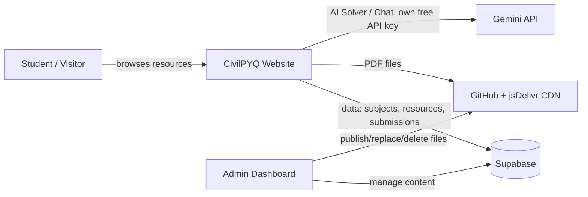

# CivilPYQ


CivilPYQ is a full-stack study platform for civil engineering students — a fast, mobile-first library of past year question papers, lab manuals, and syllabi, built around a custom multi-window PDF workspace and a Gemini-powered AI layer for solving, summarizing, and predicting exam questions directly from the source material.

## Highlights

- 🪟 **Multi-Window PDF Workspace** – Open several question papers or manuals side by side in draggable, resizable windows with taskbar-style minimize/restore, instead of the usual single-tab PDF viewer.
- 🤖 **AI Study Layer, Powered by Gemini** – Get step-by-step problem solutions, chat with the AI about the exact PDF you're reading, generate revision notes, and surface high-probability topics from historical question trends — all reading the actual document content, not just its title.
- 🔍 **Fast, Zoomable PDF Rendering** – PDF.js-based viewer tuned for quick loads even on slow connections.
- 📚 **Structured Resource Library** – Papers, lab manuals, and syllabi organized by semester and subject, always up to date.
- 🤝 **Community Contribution Pipeline** – Students can submit resources directly from the site, protected against spam and abuse.
- 📁 **CDN-Backed File Delivery** – Files are served through a GitHub + jsDelivr pipeline for fast, reliable global delivery, capped at 19MB per file to stay safely under jsDelivr's hard 20MB CDN limit.
- 🧹 **Self-Cleaning Trash** – Deleted and replaced files are automatically purged, including from GitHub, 30 days after deletion — no manual cleanup needed.
- 🛠️ **Live Maintenance Mode** – Schedule a maintenance window or start an indefinite one; the site computes whether it's currently active in real time, with no background job required to turn it back off.
- 📴 **Installable & Offline-Ready** – Add CivilPYQ to your home screen like a native app, and keep previously opened papers available in an offline library even without a connection.
- 🎨 **Polished, Responsive UI** – Dark theme, fluid transitions, and a layout that holds up from phone to desktop.

## AI Features

CivilPYQ's AI tools run on Gemini and are built to actually understand the PDF a student is looking at, not just answer generically:

- 🚀 **Dual-Mode Solver** – A heavier "Pro" mode for multi-step structural/numerical problems, and a fast, lightweight mode for quick conceptual questions — switchable per query.
- 📈 **Exam Question Predictor** – Analyzes patterns across previous years' papers for a subject to surface the topics most likely to reappear.
- 💬 **Document-Aware Chat** – A persistent chat that reads the specific PDF in view, so answers are grounded in that exact paper or manual rather than general knowledge.
- 📄 **Instant Summarization** – Turns long PDFs into concise revision notes and formula sheets on demand.
- 🔑 **Zero-Cost, Bring-Your-Own-Key Model** – Each visitor uses their own free-tier Gemini API key (stored locally in their browser only), so the AI features run at no cost to the project and scale with usage instead of hitting a shared quota.

## Tech Stack

- **Frontend**: React, Vite
- **Backend**: Supabase (Postgres, Auth, Storage, Edge Functions)
- **Automation**: GitHub Actions (scheduled edge function calls)
- **Styling**: CSS Modules
- **Icons**: Material UI Icons
- **PDF Viewer**: react-pdf (PDF.js)
- **Animation**: CSS Transitions
- **File Delivery**: GitHub + jsDelivr CDN
- **Bot Protection**: Cloudflare Turnstile
- **Hosting**: Netlify [Visit CivilPYQ](https://civilpyq.netlify.app)

## Installation

1. Requires Node.js 18 or later.

2. Clone the repository:
   ```bash
   git clone https://github.com/sigalium/civilpyq.git
   cd civilpyq
   npm install
   ```

3. Set up environment variables for the frontend. Create a `.env.local` in the project root:
   ```
   VITE_SUPABASE_URL=https://your-project.supabase.co
   VITE_SUPABASE_ANON_KEY=your-supabase-anon-key
   VITE_JSDELIVR_OWNER=your-github-username
   VITE_JSDELIVR_REPO=civil-pyq-pdf
   VITE_JSDELIVR_BRANCH=main
   VITE_TURNSTILE_SITE_KEY=your-turnstile-site-key
   ```
   `VITE_JSDELIVR_OWNER`, `VITE_JSDELIVR_REPO` and `VITE_JSDELIVR_BRANCH` must match the GitHub repo the dashboard publishes files into (see below).

4. Run the dev server:
   ```bash
   npm run dev
   ```

## How It Works

CivilPYQ splits into two simple pieces: **Supabase** holds the structured data (subjects, resource listings, submissions, admin accounts), while the actual PDF files live in a separate, public **GitHub** repository — dedicated solely to storing the PDFs, distinct from this frontend repo — and are served worldwide through the **jsDelivr CDN**. Nothing large ever passes through Supabase — it only ever stores a link.



A few things worth knowing:

- **Files aren't stored in Supabase.** When an admin publishes a PDF, it's committed straight to a GitHub repo and served through jsDelivr — this keeps file delivery fast and keeps the database itself small and free-tier friendly.
- **The AI tools never touch the backend at all.** Each visitor's browser talks directly to Google's Gemini API using a free API key they provide themselves, so the AI features cost the project nothing to run.
- **Student submissions go through a review step.** A submitted PDF is stored privately in Supabase until an admin approves it, at which point it's pushed to the GitHub PDF repo and published the same way any other resource is.

### Dashboard & Admin Roles

The `/dashboard` route is only accessible to signed-in Google accounts that have been added as an admin. Access is layered:

- **Owner** – full access to everything, including permanently deleting content, managing other admins, and site settings. Shown as "Main Admin" in the Members list.
- **Admin** – access is a set of individual switches turned on per-person as needed: reviewing submissions, editing or deleting resources, viewing trash, viewing the log, managing members, managing contributors, viewing analytics, and managing settings. An admin can have as many or as few of these as the owner decides.
- **Faculty admin** – a label, not a separate permission set. Any admin can be marked as faculty, which just shows a distinct badge and sorts them above regular admins in the Members list — their actual access still comes entirely from the individual switches above.
- **Developer** – one more individual switch, specifically for who can access maintenance mode controls inside Settings.

Every meaningful change made through the dashboard is recorded in an activity log, viewable under the Log tab.

### Dashboard Tabs

- **Submissions** – review and approve/reject student-submitted PDFs
- **Resources** – manage subjects and resources per semester, plus the academic calendar and per-semester syllabus links
- **Upload** – upload multiple resources at once
- **Migration** – tools for moving/relinking existing files
- **Contributors** – manage the student/faculty contributor list shown on the Contribute page
- **Trash** – deleted and replaced files, automatically and permanently cleaned up 30 days after deletion
- **Members** – manage admin accounts and their permissions (owner-only editing)
- **Log** – full activity history
- **Analytics** – most-viewed/most-downloaded files, storage breakdown, and view/download trends
- **Settings** – site-wide toggles: analytics demo mode, pausing new submissions, and maintenance mode

## Maintenance Mode

Maintenance mode is designed so nothing ever has to "remember" to turn it back off. Starting a window means picking one of two kinds:

- **Scheduled** – requires an end time. Once that time passes, the site is live again automatically — instantly, for every visitor, computed fresh on every page load rather than flipped by a background job.
- **Indefinite** – no end time. Stays active until an admin explicitly ends it.

While a scheduled window is active, its end time and the visitor-facing message can be edited freely — extending or shortening it just works, since it's a live value being read, not a snapshot. Once a window has ended (or hasn't been started), starting a new one always requires a fresh choice — there's no way for an old end time to silently linger and unexpectedly reactivate later.

Under the hood this is a single Postgres function, `maintenance_status()`, that both the live site and the admin dashboard call — so there is exactly one source of truth, and the toggle in Settings can never show a stale "on" after a window has actually ended.

## Automated Publishing Pipeline

Everything uploadable from the dashboard (submission approvals, resource PDFs, contributor photos, the academic calendar) is pushed straight to a GitHub repo and served through jsDelivr's CDN. No manual `git push` step is needed.

How it works:

- The dashboard uploads a file through the `github-upload` Supabase Edge Function.
- The function checks that the caller is a signed-in admin with edit rights, and that the file is under 19MB — jsDelivr hard-rejects anything over 20MB regardless of what GitHub itself would accept, so 19MB is enforced everywhere (client-side, both relevant edge functions, and the public submissions storage bucket) to leave headroom.
- It commits the file to the configured GitHub repo using the GitHub Contents API.
- It then calls jsDelivr's purge endpoint so the CDN link is live within seconds instead of waiting on cache TTL.
- The resulting `https://cdn.jsdelivr.net/...` URL is what gets stored in Supabase.

When an existing file gets replaced rather than newly added, the old version isn't just abandoned on GitHub — it's recorded in the Trash tab's Replaced section and automatically deleted 30 days later, the same as anything else in Trash.

### One-time setup

1. Create a fine-grained GitHub Personal Access Token scoped only to your PDF/asset repo (e.g. `civil-pyq-pdf`), with **Contents: Read and write** permission.

2. Set the following secrets on your Supabase project (Project Settings → Edge Functions → Secrets, or via the CLI):
   ```bash
   supabase secrets set GITHUB_TOKEN=github_pat_xxxxxxxx
   supabase secrets set GITHUB_OWNER=your-github-username
   supabase secrets set GITHUB_REPO=civil-pyq-pdf
   supabase secrets set GITHUB_BRANCH=main
   supabase secrets set TURNSTILE_SECRET_KEY=your-turnstile-secret-key
   supabase secrets set CRON_SECRET=a-long-random-string-you-generate
   ```
   `GITHUB_OWNER`, `GITHUB_REPO` and `GITHUB_BRANCH` must exactly match the `VITE_JSDELIVR_*` values used by the frontend, otherwise the URLs stored in the database won't resolve.

3. Deploy the functions:
   ```bash
   supabase functions deploy github-upload
   supabase functions deploy github-delete
   supabase functions deploy submit-resource
   supabase functions deploy purge-expired
   ```

4. Make sure every admin who should be able to publish files has one of `can_review_submissions`, `can_edit_resources`, or `can_manage_contributors` set to `true` in the `admins` table (or `role = 'owner'`).

5. On the GitHub repo that hosts this codebase (not the PDF/asset repo), add two Actions secrets under Settings → Secrets and variables → Actions: `SUPABASE_URL` (your project URL) and `CRON_SECRET` (the exact same value you set in step 2). This is what lets the daily scheduled workflow authenticate to `purge-expired` — see below.

Once this is set up, approving a submission, adding a resource, uploading a contributor photo, or replacing the academic calendar in the dashboard all publish directly to GitHub and the CDN — there is no separate manual step.

## Scheduled Cleanup

A GitHub Actions workflow (`.github/workflows/purge-expired.yml`) runs once a day and calls the `purge-expired` edge function, which:

- Permanently deletes resources, subjects, and contributors that have been sitting in Trash for 30+ days — including deleting the matching file from GitHub for anything that had one.
- Permanently deletes entries in the Replaced section of Trash that have aged past 30 days, same GitHub cleanup included.

This function authenticates via a shared `CRON_SECRET` header rather than a user login, since a scheduled job has no one signed in — see the one-time setup above for how that's configured. It can also be triggered manually from the Actions tab (`workflow_dispatch`) to test it without waiting for the schedule.

## Edge Functions

| Function | Purpose |
|---|---|
| `submit-resource` | Handles student PDF submissions from the Contribute page, using the service role key so no public write access to the database is needed |
| `github-upload` | Publishes an approved/edited file to the GitHub repo and purges the jsDelivr cache, as described above |
| `github-delete` | Removes a file from the GitHub repo (restricted to the `pdfs/` and `Contributor/` paths) when a resource or contributor photo is permanently deleted |
| `migrate-file` | Used by the dashboard's Migration tab to move or relink existing resource files |
| `scan-file` | Scans uploaded files before they're accepted, used by Submissions, Resources, Bulk Upload, and Contributors tabs |
| `backfill-file-sizes` | Fills in file sizes for older resources that don't have one recorded yet, by looking the file up on GitHub. Safe to run more than once |
| `purge-expired` | Runs daily via GitHub Actions; permanently deletes expired Trash and Replaced-file entries, GitHub files included, as described above |

## AI Features (Bring Your Own Key)

The AI Chat and Exam Predictor widgets run entirely client-side against the Gemini API using an API key the visitor provides themselves (free at [aistudio.google.com](https://aistudio.google.com/apikey)) — this keeps the site free to run for the project owner, since every visitor uses their own free-tier Gemini quota rather than a shared key. The key is stored in the browser's `localStorage`/`sessionStorage` only and never touches Supabase.

Both widgets show a running count of requests made that day per saved key, and the Exam Predictor will offer to reopen a previous chat for a subject if one was already saved in that browser.

## Where Your Secrets Go

Quick reference for setting things up — where each value belongs:

| Value | Goes in | Notes |
|---|---|---|
| `VITE_SUPABASE_URL`, `VITE_SUPABASE_ANON_KEY` | Netlify env vars | Safe to be public, this is what the site uses to talk to Supabase |
| `VITE_JSDELIVR_OWNER/REPO/BRANCH`, `VITE_TURNSTILE_SITE_KEY` | Netlify env vars | Also public-safe |
| `GITHUB_TOKEN`, `GITHUB_OWNER/REPO/BRANCH` | Supabase Edge Function secrets | Grants write access to your PDF repo — never expose this to the frontend |
| `TURNSTILE_SECRET_KEY` | Supabase Edge Function secrets | Server-side only |
| `CRON_SECRET` | Both Supabase Edge Function secrets **and** GitHub Actions secrets on this repo | Has to match in both places — it's how the daily cleanup job proves it's allowed to run |

